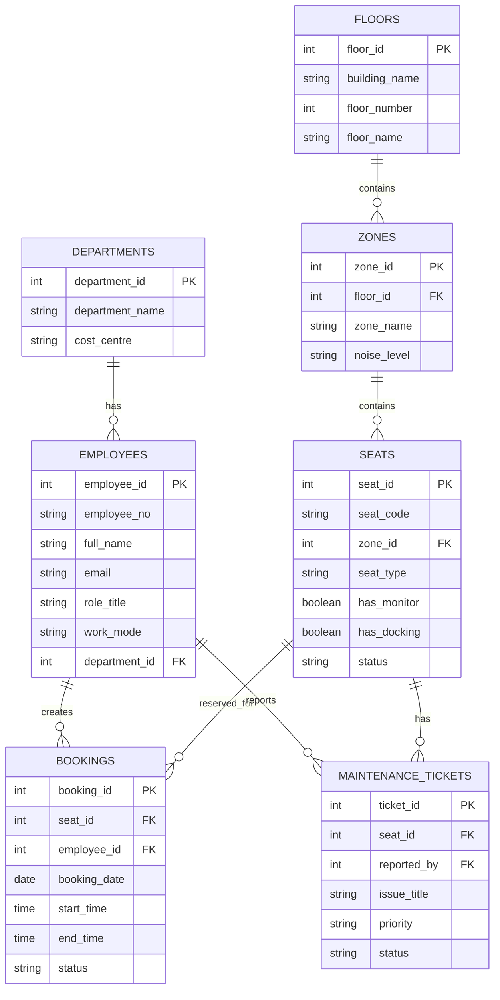

# ER Diagram

```mermaid
erDiagram
    DEPARTMENTS ||--o{ EMPLOYEES : has
    FLOORS ||--o{ ZONES : contains
    ZONES ||--o{ SEATS : contains
    EMPLOYEES ||--o{ BOOKINGS : creates
    SEATS ||--o{ BOOKINGS : reserved_for
    EMPLOYEES ||--o{ MAINTENANCE_TICKETS : reports
    SEATS ||--o{ MAINTENANCE_TICKETS : has

    DEPARTMENTS {
        int department_id PK
        string department_name
        string cost_centre
    }
    EMPLOYEES {
        int employee_id PK
        string employee_no
        string full_name
        string email
        string role_title
        string work_mode
        int department_id FK
    }
    FLOORS {
        int floor_id PK
        string building_name
        int floor_number
        string floor_name
    }
    ZONES {
        int zone_id PK
        int floor_id FK
        string zone_name
        string noise_level
    }
    SEATS {
        int seat_id PK
        string seat_code
        int zone_id FK
        string seat_type
        boolean has_monitor
        boolean has_docking
        string status
    }
    BOOKINGS {
        int booking_id PK
        int seat_id FK
        int employee_id FK
        date booking_date
        time start_time
        time end_time
        string status
    }
    MAINTENANCE_TICKETS {
        int ticket_id PK
        int seat_id FK
        int reported_by FK
        string issue_title
        string priority
        string status
    }
```
